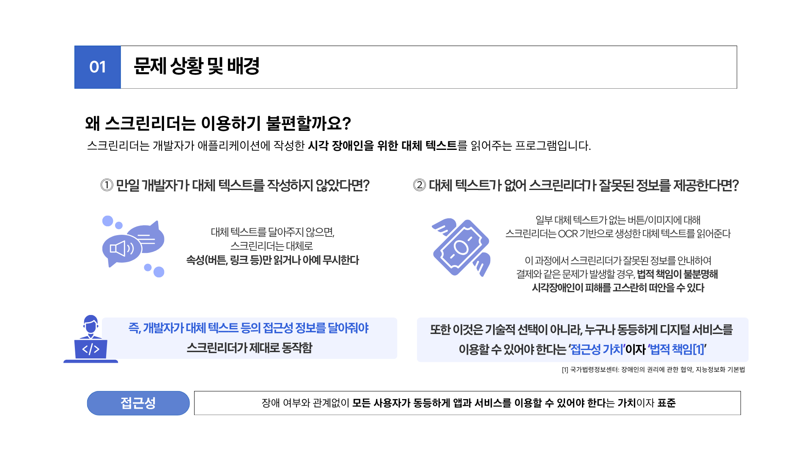
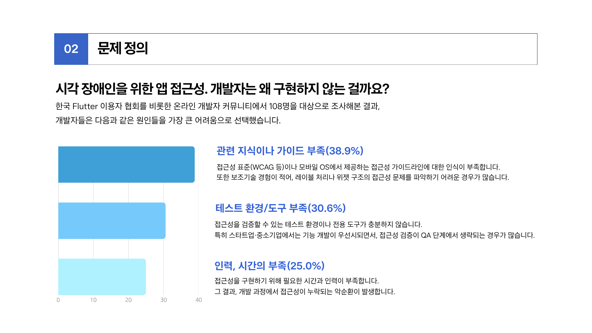
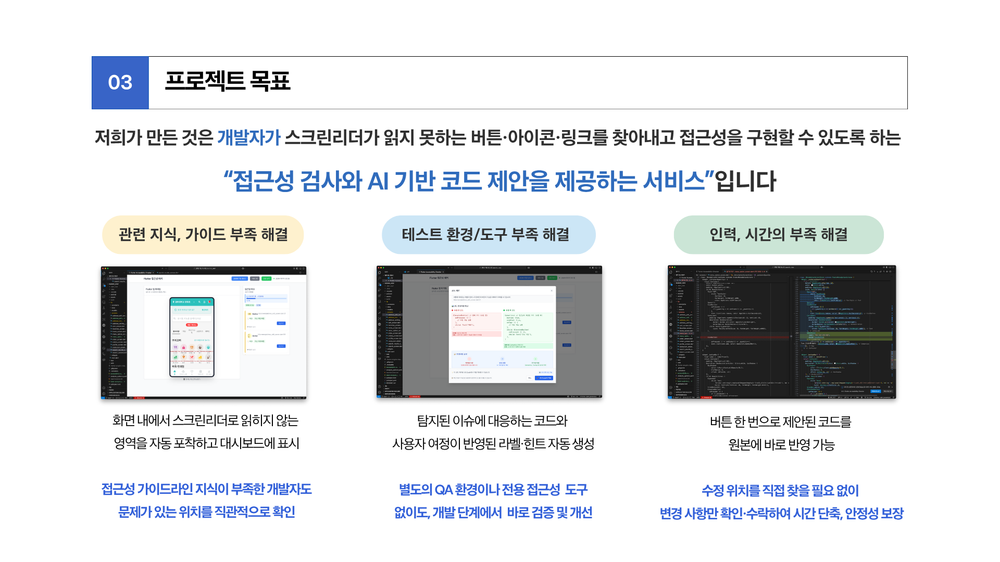
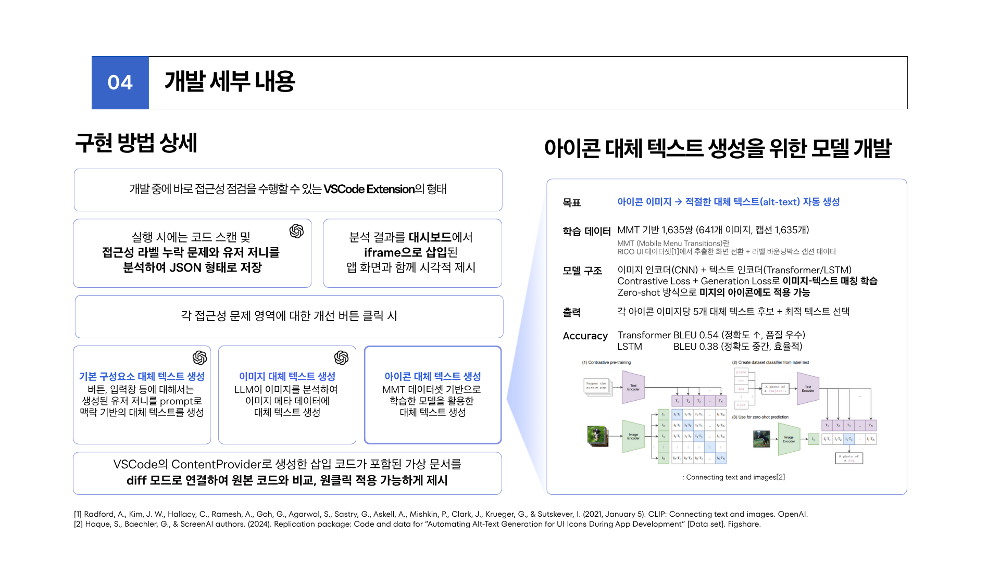
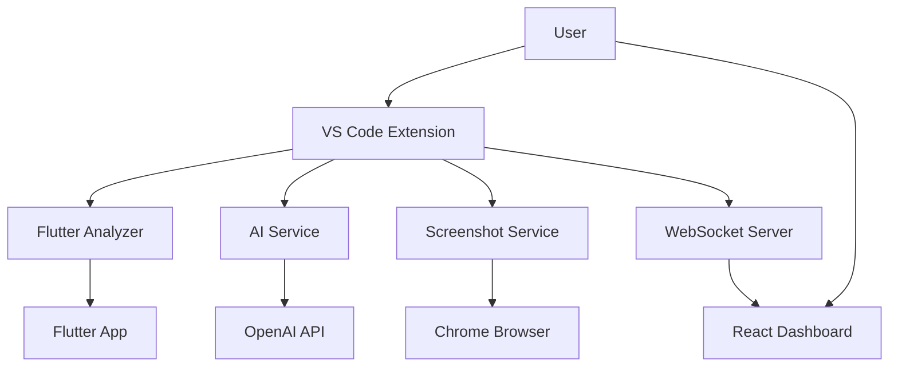
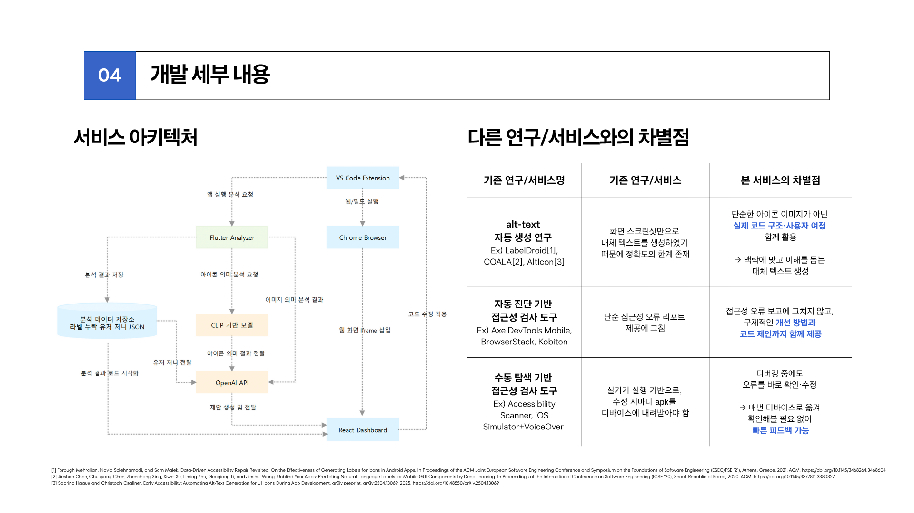
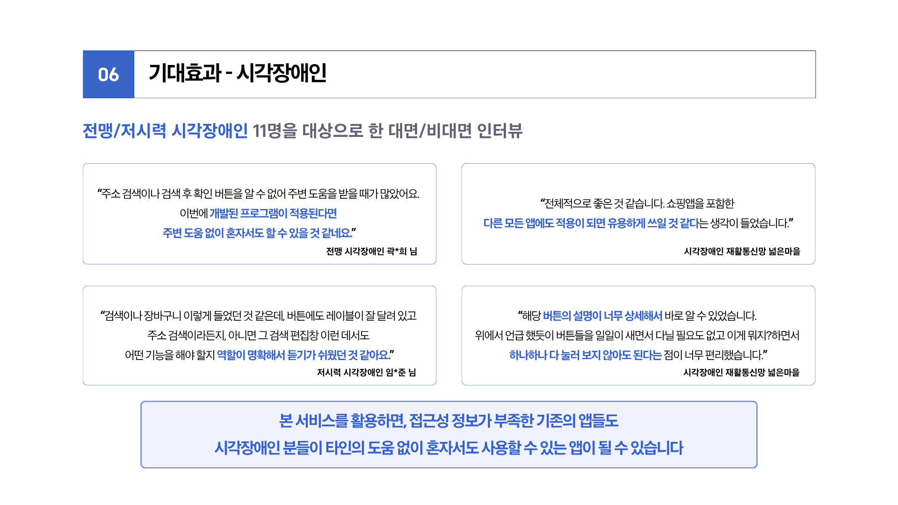

# Flutter Accessibility Checker

<div align="center">


**VS Code 확장 프로그램으로 Flutter 앱의 접근성을 실시간으로 분석하고 개선 제안을 제공하는 AI 기반 도구**

[](https://opensource.org/licenses/MIT)
[](http://makeapullrequest.com)

</div>

## 📖 소개

Flutter Accessibility Checker는 Flutter 앱의 접근성을 자동으로 분석하고 개선 제안을 제공하는 VS Code 확장 프로그램입니다. AI 기술을 활용하여 실시간으로 접근성 이슈를 감지하고, 시각적 피드백과 함께 구체적인 코드 개선 방안을 제시합니다.


## ✨ 주요 기능
이 시스템은 Flutter 앱의 접근성 이슈를 실시간으로 감지하고, 문제가 있는 요소를 스크린샷과 바운딩 박스로 시각적으로 표시합니다. 또한 AI 기반의 지능형 코드 제안 기능을 통해 자동으로 개선 코드를 생성하고 원클릭으로 적용할 수 있습니다.
다양한 사용자 페르소나 관점에서 접근성을 분석할 수 있으며, React 기반의 실시간 대시보드를 통해 전체 상태를 모니터링할 수 있습니다.
시스템은 OpenAI GPT 모델을 지원하며, CLIP 모델은 별도 문의를 통해 사용할 수 있습니다.



## 🚀 빠른 시작

### 📋 시스템 요구사항
- VS Code 1.80.0 이상
- Flutter SDK 3.0.0 이상
- Node.js 16.0.0 이상
- Chrome 브라우저

### ⚡ 설치 및 실행

```bash
# 1. 저장소 클론 및 의존성 설치
git clone https://github.com/your-username/flutter-accessbility-checker.git
cd flutter-accessbility-checker
npm install

# 2. 환경 변수 설정
cp env.example .env

# 3. TypeScript 컴파일
npm run compile

# 4. React 앱 설정
cd react-app && npm install && cd ..

# 5. VS Code에서 실행
code .
```



## ⚙️ 설정 가이드

### 🔑 환경 변수 설정

`.env` 파일을 생성하고 다음 설정을 추가하세요:

```env
# OpenAI API Keys
OPENAI_API_KEY=your_openai_api_key_here
OPENAI_API_KEY2=your_openai_api_key2_here

# AI 모델 설정
AI_MODEL_TYPE=openai
AI_MODEL_NAME=gpt-3.5-turbo
AI_MAX_TOKENS=2000
AI_TEMPERATURE=0.7

# 포트 설정
FLUTTER_PORT=64022
REACT_APP_PORT=3000
WEBSOCKET_PORT=3001

# 분석 설정
MAX_PERSONA_COUNT=10
SCREENSHOT_INTERVAL=5000
MAX_RETRY_ATTEMPTS=3
```

### 🤖 AI 모델 설정

#### OpenAI 사용 (권장)
```env
AI_MODEL_TYPE=openai
AI_MODEL_NAME=gpt-3.5-turbo  # 또는 gpt-4
```

#### CLIP 모델 사용
CLIP 모델을 사용하려면 별도로 문의해주세요.




## 🎯 사용 방법

### 📱 기본 사용법

1. Flutter 프로젝트를 VS Code에서 열기
2. Command Palette (`Ctrl+Shift+P` 또는 `Cmd+Shift+P`) 열기
3. `Flutter Accessibility: Start Analysis` 명령 실행
4. 페르소나 수 입력 (1-10개 권장)

### 🚀 자동 실행되는 서비스들
- **Flutter 앱**: 포트 64022에서 자동 실행
- **React 대시보드**: 포트 3000에서 자동 실행
- **WebSocket 서버**: 포트 3001에서 자동 실행
- **브라우저**: React 대시보드 자동 열기



## 🏗️ 아키텍처

### 📐 시스템 구조



### 🔄 데이터 플로우

1. **분석 시작**: 사용자가 VS Code에서 분석 명령 실행
2. **Flutter 앱 실행**: 지정된 포트에서 Flutter 앱 자동 실행
3. **스크린샷 캡처**: Chrome을 통해 앱 화면 캡처
4. **AI 분석**: 캡처된 이미지와 코드를 AI 모델로 분석
5. **결과 표시**: React 대시보드에서 실시간 결과 표시
6. **코드 제안**: 개선된 코드를 VS Code에서 제안



## ⚡ 성능 최적화

### 🚀 빠른 응답을 위한 설정

```env
# 빠른 응답 설정
AI_TEMPERATURE=0.3          # 낮은 창의성으로 일관된 결과
AI_MAX_TOKENS=1000          # 적은 토큰으로 빠른 처리
SCREENSHOT_INTERVAL=3000    # 더 자주 스크린샷 캡처
```

### 🧠 대용량 프로젝트 분석

```env
# 대용량 프로젝트 설정
AI_MAX_TOKENS=8000          # 더 많은 토큰 사용
AI_MODEL_NAME=gpt-4-32k     # 긴 컨텍스트 지원 모델
MAX_PERSONA_COUNT=5         # 페르소나 수 제한으로 성능 향상
```



## 🚨 문제 해결

### 🔧 일반적인 문제들

#### Flutter 앱 실행 실패
```bash
# 1. Flutter SDK 확인
flutter doctor

# 2. 포트 충돌 확인
lsof -i :64022

# 3. Flutter 앱 수동 실행
flutter run --web-port=64022
```

#### 느린 응답 속도
```env
# 빠른 응답을 위한 설정
AI_TEMPERATURE=0.1
SCREENSHOT_INTERVAL=10000
```

#### 메모리 부족 오류
```env
# 환경 변수 조정
AI_MAX_TOKENS=1000
MAX_PERSONA_COUNT=3
```

### 📋 디버깅 체크리스트

- [ ] 환경 변수 설정 확인 (`.env` 파일)
- [ ] 필요한 포트들이 사용 가능한지 확인
- [ ] Chrome 브라우저가 설치되어 있는지 확인
- [ ] Flutter SDK가 올바르게 설치되어 있는지 확인
- [ ] OpenAI API 키가 올바르게 설정되어 있는지 확인

## 🤝 기여하기

### 🛠️ 개발 환경 설정

```bash
# 1. 저장소 포크 및 클론
git clone https://github.com/your-username/flutter-accessbility-checker.git
cd flutter-accessbility-checker

# 2. 개발 의존성 설치
npm install

# 3. 개발 모드 실행
npm run watch

# 4. 테스트 실행
npm test
```

### 📝 기여 가이드라인

1. **이슈 생성**: 버그 리포트나 기능 요청
2. **브랜치 생성**: `feature/새로운기능` 또는 `fix/버그수정`
3. **코드 작성**: 명확한 주석과 함께 코드 작성
4. **테스트**: 새로운 기능에 대한 테스트 추가
5. **풀 리퀘스트**: 상세한 설명과 함께 PR 생성


---


| 이름 | GitHub |
|------|--------|
| 오종현 | [@Sjaize](https://github.com/Sjaize) |
| 오찬세 | [@chansses](https://github.com/chansses) |
| 정유진 | [@YuujInJeong](https://github.com/YuujInJeong) |
| 한지훈 | [@jhhan0208](https://github.com/jhhan0208) |
