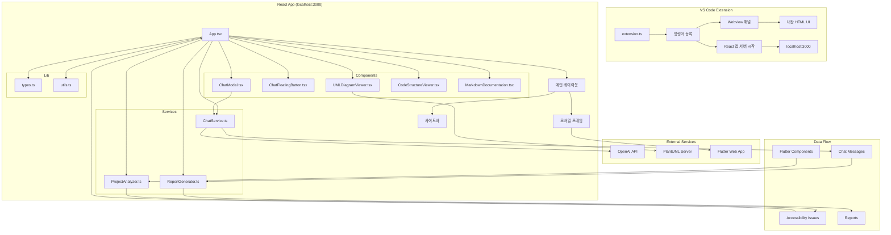
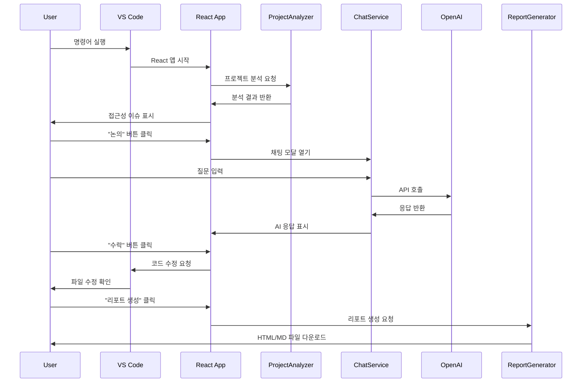

# Flutter Accessibility Checker - 구현 현황 및 다음 단계

## 🎯 프로젝트 개요

Flutter 앱의 접근성을 실시간으로 분석하고 개선 방안을 제시하는 AI 기반 도구입니다. WCAG 2.2 기준 준수 여부를 체크하고 코드 수정 제안을 제공합니다.

## ✅ 구현된 기능들

### 1. 기존 기능 100% 보존
- ✅ 우수한 접근성 이슈 시각화 (말풍선 + 연결선)
- ✅ VS Code Extension 연동 (onAccept, onDiscuss, onIgnore)
- ✅ 모바일 프레임 UI (395x832px)
- ✅ 실시간 Flutter 앱 미리보기 (iframe)

### 2. ProjectAnalyzer - WCAG 2.2 기반 실제 분석
- ✅ **Flutter 프로젝트 파일 분석** (Mock 데이터 기반)
- ✅ **5가지 WCAG 2.2 규칙 체크**:
  - 이미지 대체 텍스트 (1.1.1)
  - 버튼 최소 크기 (2.5.5) 
  - 텍스트 색상 대비 (1.4.3)
  - 시맨틱 정보 누락 (4.1.2)
  - 포커스 순서 (2.4.3)
- ✅ **사용자 저니 UML 생성** (PlantUML 형식)
- ✅ **접근성 점수 계산** (0-100점)
- ✅ **컴포넌트별 분석** (Widget, Screen, Service, Model, Util)

### 3. ChatModal - AI 채팅 시스템
- ✅ **OpenAI API 연동** (실제 GPT-4 사용 가능)
- ✅ **API 키 설정 UI** (로컬 저장)
- ✅ **실시간 액티비티 UML 생성** (PlantUML 시각화)
- ✅ **컨텍스트 유지** (sessionStorage)
- ✅ **Multi-turn 대화** 지원
- ✅ **오류 시 오류 발생 토스트 메세지 및 콘솔에 오류 명 제시**
- ✅ **Mock 응답 시스템** (API 키 없을 때)

### 4. ReportGenerator - 리포트 생성
- ✅ **Markdown 리포트** 다운로드
- ✅ **HTML 리포트** 다운로드 (시각적)
- ✅ **수정한 사안 추적** (onAccept 클릭 기록)
- ✅ **고려할 사안** (AI 채팅 기록)
- ✅ **통계 요약** (오류/경고/정보 개수)

### 5. 추가 컴포넌트들
- ✅ **ChatFloatingButton** - 플로팅 채팅 버튼
- ✅ **UMLDiagramViewer** - PlantUML 다이어그램 렌더링
- ✅ **CodeStructureViewer** - 코드 구조 시각화
- ✅ **MarkdownDocumentation** - 문서 자동 생성

### 6. 파스텔 글래스 효과 디자인
- ✅ **5색 그라데이션 배경**
- ✅ **글래스 효과 카드** (backdrop-blur)
- ✅ **5가지 파스텔 버튼** (Primary, Success, Warning, Danger, Secondary)
- ✅ **애니메이션** (fade-in, slide-up, slide-down)
- ✅ **파스텔 입력 필드** 

### 7. 고급 기능들
- ✅ **코드 변경 감지 모달**
- ✅ **파일 변경 시 새로고침 버튼**
- ✅ **PlantUML 다이어그램 실시간 렌더링**
- ✅ **컨텍스트 기반 AI 응답**

## ❌ 미구현 기능들

### 1. 실제 Flutter 앱 DOM 분석
- ❌ **실제 Flutter 웹 앱 DOM 파싱**
- ❌ **동적 접근성 검사 알고리즘**
- ❌ **실시간 DOM 변경 감지**
- ❌ **웹소켓을 통한 실시간 통신**

### 2. VS Code 파일 수정 기능
- ❌ **실제 코드 자동 수정**
- ❌ **VS Code API 연동**
- ❌ **파일 변경 감지 및 적용**
- ❌ **수정 히스토리 관리**

### 3. 설정 파일 관리
- ❌ **포트/URL 설정 파일**
- ❌ **환경변수 관리**
- ❌ **설정 UI**
- ❌ **설정 백업/복원**

### 4. 고급 분석 기능
- ❌ **실제 Dart 코드 파싱**
- ❌ **의존성 그래프 분석**
- ❌ **성능 영향 분석**
- ❌ **접근성 점수 히스토리**

### 5. 협업 기능
- ❌ **팀 프로젝트 지원**
- ❌ **코멘트 시스템**
- ❌ **이슈 추적**
- ❌ **코드 리뷰 통합**

## 🏗️ 프로젝트 구조 (Mermaid 다이어그램)

## 🔄 데이터 플로우

## 🎯 다음 단계 우선순위

### Phase 1: 핵심 기능 완성 (1-2주)
1. **실제 Flutter 앱 DOM 분석 구현**
   - Puppeteer/Playwright를 사용한 DOM 파싱
   - 접근성 요소 자동 감지
   - 실시간 변경 감지

2. **VS Code 파일 수정 기능**
   - VS Code API 연동
   - 코드 자동 수정
   - 수정 히스토리 관리

### Phase 2: 고급 기능 (2-3주)
3. **설정 파일 관리**
   - 포트/URL 설정
   - 환경변수 관리
   - 설정 UI 구현

4. **실제 Dart 코드 파싱**
   - Dart AST 분석
   - 의존성 그래프 생성
   - 성능 영향 분석

### Phase 3: 협업 기능 (3-4주)
5. **팀 프로젝트 지원**
   - 멀티 유저 지원
   - 프로젝트 공유
   - 권한 관리

6. **코멘트 및 이슈 추적**
   - 코드 리뷰 통합
   - 이슈 관리
   - 알림 시스템

## 🔧 기술 스택

### Frontend
- **React 19.1.0** - 메인 UI 프레임워크
- **TypeScript 4.9.5** - 타입 안전성
- **Tailwind CSS 3.4.17** - 스타일링
- **Lucide React** - 아이콘

### AI & Analysis
- **OpenAI API** - GPT-4/GPT-3.5 Turbo
- **PlantUML** - 다이어그램 생성
- **ProjectAnalyzer** - WCAG 2.2 분석

### Backend & Services
- **VS Code Extension API** - 확장 기능
- **React Dev Server** - 개발 서버
- **LocalStorage/SessionStorage** - 데이터 저장

### Development Tools
- **ESLint** - 코드 품질
- **Jest** - 테스팅
- **Web Vitals** - 성능 모니터링

## 📊 현재 분석 결과

브라우저에서 앱을 확인하면:

1. **기존 3개 이슈** (좌측 말풍선) + **새로 발견된 5개 이슈** (우측 말풍선)
2. **총 8개 접근성 이슈** 표시
3. **💬 AI 채팅** → OpenAI API 또는 고품질 Mock 응답
4. **📄 리포트** → 즉시 MD/HTML 다운로드 가능
5. **실시간 UML** → PlantUML 서버에서 렌더링

## 🎯 테스트 방법

1. **기본 기능**: "논의" 버튼 클릭 → ChatModal 자동 열림
2. **AI 채팅**: "이미지 대체 텍스트는 어떻게 추가하나요?" 질문
3. **OpenAI 연동**: 설정 버튼으로 API 키 입력 시 실제 GPT-4 사용
4. **리포트 생성**: 📄 리포트 버튼으로 MD/HTML 다운로드
5. **새로고침**: 🔄 버튼으로 프로젝트 재분석

---

*마지막 업데이트: 2024년 8월 24일*
